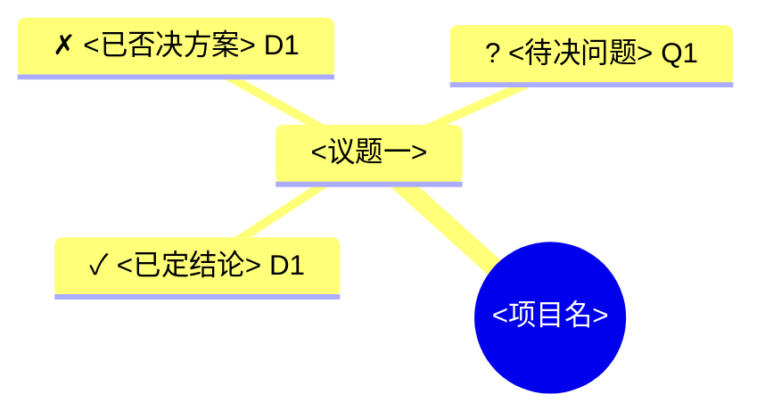

# 对话脑图:<项目或主题>

> **更新水位**:<YYYY-MM-DD HH:MM> · 已覆盖至「<最后一个入图的节点>」
> **给下一个会话**:接手同一主题前先读本文件。标 `✗` 的是已否决路径,不要重提;标 `?` 的是待决问题,优先处理。

## 脑图

## 决策记录

### D1 · <一句话结论>

- **决定**:
- **理由**:
- **否决了**:
- **失效条件**:

## 待决问题

- **Q1** <问题> — 阻塞:<它挡住了什么> · 需要:<谁的输入或什么信息>

## 压缩时间线

- <日期> <这一段做了什么> → <结论,指向 D1 / commit / 文件>

## 已归档

<!-- 已完成且不会再改的议题移到这里,保留决策编号以便回溯 -->
