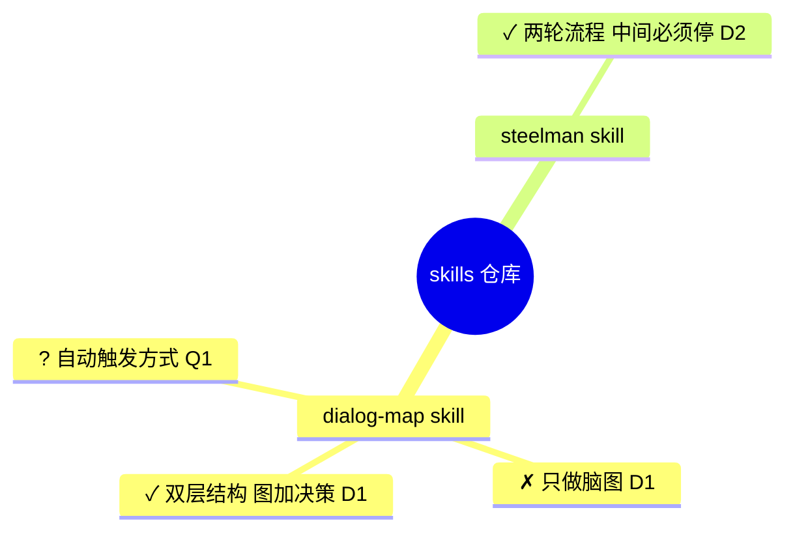

# 脑图格式与易错点

## Mermaid mindmap 基本语法

层级**完全由缩进决定**,没有连线符号。同级节点缩进必须严格一致,否则整块渲染失败。



根节点形状:`root((文字))` 圆形、`root[文字]` 方形、`root(文字)` 圆角。子节点直接写文字即可,不需要形状。

## 三个必踩的坑

**1. 括号、冒号、方括号会直接导致解析失败。** 节点文本里出现 `(` `)` `[` `]` `{` `}` `:` 时,mermaid 会当成形状语法来解析然后报错。两种解法:

```
✗ 双层结构(图+决策)        <- 渲染失败
✓ 双层结构 图加决策         <- 改写,推荐
✓ ["双层结构(图+决策)"]     <- 加引号包裹,能用但更啰嗦
```

写节点时习惯性避开这些符号,用空格或"加"代替,比事后调试省事。

**2. mindmap 不支持跨分支连线。** 它只能表达树,画不出"A 分支的结论影响了 B 分支"。需要交叉引用时,在节点文本里带上决策编号(`D3`),让读者自己跳转——这也是决策编号存在的原因之一。需要真正的图关系时,该换 `flowchart`,不要硬掰 mindmap。

**3. 没有可靠的单节点着色。** mindmap 的 class 和 icon 支持在各渲染器间不一致(GitHub、VS Code、飞书画板表现都不同)。所以状态用**文本前缀符号**表达,而不是颜色:

| 符号 | 含义 | 用在什么地方 |
|---|---|---|
| `✓` | 已定 | 已经做出的选择 |
| `✗` | 已否决 | 考虑过并放弃的路径,保留不删 |
| `?` | 待决 | 悬而未决,通常对应一个 Q 编号 |
| `!` | 约束 | 撞到的客观事实(如 API 需认证、目录只读) |

## 结构约定

- **根节点**:项目名,不是本次讨论的主题——文件是项目级的,会跨多次会话累积。
- **一级分支**:议题。一个议题对应一个可以独立结束的问题,议题结束后整支可以归档。
- **二三级**:该议题下的结论、否决项、待决问题。深度控制在三层以内,再深就说明这个议题该拆成两个。
- **节点长度**:一行以内,长了就说明内容属于决策记录而不是图。

## 增量更新时的判断

更新脑图时,新内容按这个顺序找位置:

1. 能挂到已有议题下 → 挂进去,不新建分支
2. 是对已有节点的推翻 → 把原节点标记改成 `✗`,在旁边新增 `✓` 节点,两者都指向同一个决策编号(决策记录里写清推翻的理由)
3. 确实是新议题 → 新建一级分支

第 2 种情况最容易被做错成"直接改写原节点"。改写会让图看起来一直很干净,但丢掉了"我们试过那条路"的信息,下个会话就会再试一次。
