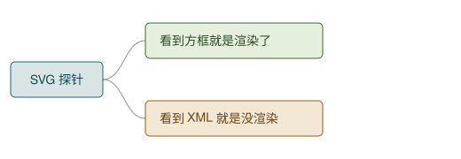

# 作图语法渲染探针

把这个文件在任何客户端里打开一次,就知道它支持哪种作图语法。四个探针是同一棵树的四种写法,每个探针下面写了"通过"长什么样。

结果填到最后的表格里。加了新客户端就再跑一次——这是个可复用的诊断工具,不是一次性测试。

---

## 探针 A · Mermaid 代码块

**通过 = 看到一张放射状的图。不通过 = 看到 `mindmap` 开头的几行源码。**

---

## 探针 B1 · Markdown 里的内联 SVG

**通过 = 看到两个方框和连线。不通过 = 看到 `<svg ...>` 标签,或者整块消失(被安全过滤掉了)。**

<svg xmlns="http://www.w3.org/2000/svg" width="420" height="120" viewBox="0 0 420 120" role="img" aria-label="内联 SVG 探针">
  <path d="M104,60 C128,60 128,34 152,34" fill="none" stroke="#8A9199" stroke-width="1"/>
  <path d="M104,60 C128,60 128,86 152,86" fill="none" stroke="#8A9199" stroke-width="1"/>
  <rect x="12" y="40" width="92" height="40" rx="5" fill="#D8E5E4" stroke="#1B6B72" stroke-width="1"/>
  <text x="58" y="65" text-anchor="middle" font-family="Helvetica, Arial, sans-serif" font-size="13" fill="#134B50">探针 B1</text>
  <rect x="152" y="14" width="180" height="40" rx="5" fill="#E4EFDD" stroke="#3E6B34" stroke-width="1"/>
  <text x="166" y="39" font-family="Helvetica, Arial, sans-serif" font-size="13" fill="#2C4C25">看到方框就是渲染了</text>
  <rect x="152" y="66" width="180" height="40" rx="5" fill="#F3E7D6" stroke="#8A6410" stroke-width="1"/>
  <text x="166" y="91" font-family="Helvetica, Arial, sans-serif" font-size="13" fill="#63480B">看到标签就是没渲染</text>
</svg>

---

## 探针 B2 · 引用独立 SVG 文件

**通过 = 看到三个方框。不通过 = 看到一个碎图标、alt 文字,或者什么都没有。**

这一项和 B1 是两回事:很多渲染器过滤内联 HTML(B1 失败),但正常显示图片引用(B2 通过)。

---

## 探针 C · 嵌套列表

**通过 = 看到缩进的层级列表。这一项在任何地方都应该通过——它就是纯文本,不依赖任何渲染能力。如果它都不通过,说明这个客户端根本没在渲染 Markdown。**

- **探针 C**
  - 第一层
    - ✓ 已定
    - ✗ 已否决
    - ? 待决
    - ! 约束

---

## 结果表

在你实际会读到脑图的每个客户端里跑一遍,填进去。

| 客户端 | A · Mermaid | B1 · 内联 SVG | B2 · SVG 文件 | C · 嵌套列表 |
|---|---|---|---|---|
| Claude Code 终端 | 源码 | 源码 | 不显示 | 通过 |
| Claude Desktop · Claude Code 标签页 | 源码 | 源码 | ? | 通过 |
| Claude Artifact 页面 | 通过 | 通过 | ? | 通过 |
| Codex 桌面应用 | ? | ? | ? | ? |
| Codex CLI 终端 | ? | ? | ? | ? |
| VS Code Markdown 预览 | ? | ? | ? | ? |
| GitHub 仓库页 | ? | ? | ? | ? |

已填的三行是本次已确认的结果。`?` 是还没测的。

## 怎么测

- **Codex 桌面应用 / CLI**:让它读这个文件并显示内容,或直接在它的文件查看界面打开。
- **VS Code**:打开 `probe.md`,按 `Cmd+Shift+V` 开预览。
- **GitHub**:把 `render-probe/` 推上去,在网页上打开 `probe.md`。注意 GitHub 会过滤内联 HTML,B1 预期失败。
- **终端**:`cat probe.md` —— 全部是源码,只有 C 可读。这不是缺陷,是终端的本质。

## 怎么用结果

看**列**,不是看行。

在你实际会用到的客户端里,哪一列全绿,那一列就是**存储格式**——长期文件必须用它写,因为文件会被多个客户端反复读到。

其余各列是**展示格式**:想看图的时候现场生成,看完即弃。选覆盖面最广的那一列作为默认展示格式,而不是最好看的那一列。

存储格式和展示格式不要在同一个文件里同时长期维护两份——手工同步必然漂移,漂移之后你不知道该信哪一份。
