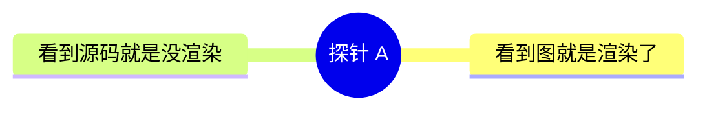
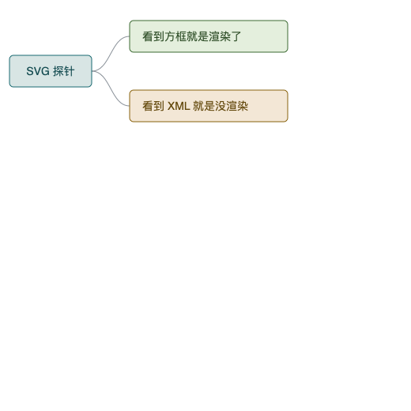

# 作图语法渲染探针

把这个文件在任何客户端里打开一次,就知道它支持哪种作图语法。四个探针是同一棵树的四种写法,每个探针下面写了"通过"长什么样。

结果填到最后的表格里。加了新客户端就再跑一次——这是个可复用的诊断工具,不是一次性测试。

---

## 探针 A · Mermaid 代码块

**通过 = 看到一张放射状的图。不通过 = 看到 `mindmap` 开头的几行源码。**

---

## 探针 B1 · Markdown 里的内联 SVG

**通过 = 看到两个方框和连线。不通过 = 看到 `<svg ...>` 标签,或者整块消失(被安全过滤掉了)。**

<svg xmlns="http://www.w3.org/2000/svg" width="420" height="120" viewBox="0 0 420 120" role="img" aria-label="内联 SVG 探针">
  <path d="M104,60 C128,60 128,34 152,34" fill="none" stroke="#8A9199" stroke-width="1"/>
  <path d="M104,60 C128,60 128,86 152,86" fill="none" stroke="#8A9199" stroke-width="1"/>
  <rect x="12" y="40" width="92" height="40" rx="5" fill="#D8E5E4" stroke="#1B6B72" stroke-width="1"/>
  <text x="58" y="65" text-anchor="middle" font-family="Helvetica, Arial, sans-serif" font-size="13" fill="#134B50">探针 B1</text>
  <rect x="152" y="14" width="180" height="40" rx="5" fill="#E4EFDD" stroke="#3E6B34" stroke-width="1"/>
  <text x="166" y="39" font-family="Helvetica, Arial, sans-serif" font-size="13" fill="#2C4C25">看到方框就是渲染了</text>
  <rect x="152" y="66" width="180" height="40" rx="5" fill="#F3E7D6" stroke="#8A6410" stroke-width="1"/>
  <text x="166" y="91" font-family="Helvetica, Arial, sans-serif" font-size="13" fill="#63480B">看到标签就是没渲染</text>
</svg>

---

## 探针 B2 · 引用独立图片文件

**通过 = 看到三个方框的图。不通过 = 碎图标、只剩 alt 文字、什么都没有,或者 `!` 变成字面量、括号里的内容变成超链接。**

这一项和 B1 是两回事:很多渲染器过滤内联 HTML(B1 失败),但正常显示图片引用(B2 通过)。

**B2 拆成五个变体,目的是隔离病因。** 只看"B2 失败"没法区分三种完全不同的原因:路径写法不对、客户端不支持本地文件访问、还是只对 SVG 有问题。挨个看哪个出图,病因就定位了:

**B2a · 同级相对路径**(最常见的写法)

**B2b · 显式相对路径**(有些渲染器只认 `./` 前缀)

**B2c · 绝对路径**(排除相对路径解析问题;换机器需改这一行)

**B2d · PNG 而非 SVG,同级相对路径**(关键对照组:如果这个出图但上面三个都不出,问题就是 SVG 专属的;如果这个也不出,问题是本地图片访问)

**B2e · 远程 URL**(排除本地文件访问限制;仓库推送后才有效)

### 测 B2 之前必须确认一件事

**打开的必须是仓库里的原始 `probe.md`,不能是被复制或通过聊天发送出去的副本。** 副本脱离了同目录的 `probe.svg` 和 `probe.png`,相对路径当然解析不了——那时 B2a/B2b/B2d 失败是测试环境的问题,不是客户端的问题。判断方法:确认文件路径是 `.../render-probe/probe.md`,且同目录下能看到 `probe.svg` 和 `probe.png`。

---

## 探针 C · 嵌套列表

**通过 = 看到缩进的层级列表。这一项在任何地方都应该通过——它就是纯文本,不依赖任何渲染能力。如果它都不通过,说明这个客户端根本没在渲染 Markdown。**

- **探针 C**
  - 第一层
    - ✓ 已定
    - ✗ 已否决
    - ? 待决
    - ! 约束

---

## 结果表

在你实际会读到脑图的每个客户端里跑一遍,填进去。

| 客户端 | A · Mermaid | B1 · 内联 SVG | B2 · 图片引用 | C · 嵌套列表 |
|---|---|---|---|---|
| Claude Code 终端 | ✗ 源码 | ✗ 源码 | ✗ | ✓ |
| Claude Desktop · Claude Code 标签页 | ✗ 源码 | ✗ 源码 | — | ✓ |
| Claude Artifact 页面 | ✓ | ✓ | — | ✓ |
| 某 Markdown 渲染视图(客户端待确认) | ✓ | ✗ 源码 | ⚠ 待重测 | ✓ |
| Codex CLI 终端 | — | — | — | — |
| VS Code Markdown 预览 | (✓) | (需扩展) | (✓) | ✓ |
| GitHub 仓库页 | (✓) | (被过滤) | (✓) | ✓ |

`✓` 出图 · `✗` 不出图 · `—` 未测 · `⚠` 测过但结果不可信 · `(括号)` 依据文档预期,未实测。

### 第四行为什么写"客户端待确认"

那一轮截图显示 mermaid 出图、内联 SVG 出源码、嵌套列表正常。但**截图来自哪个客户端没有被明确记录**——当时是在讨论 Codex 兼容性的上下文里,于是被记成了"Codex 桌面应用"。这是从上下文推断的,不是被确认的。测量记录里不能放推断,所以改回待确认。

### B2 为什么标"待重测"

原始写法 `` 的路径是对的:`probe.svg` 与 `probe.md` 同目录,同级相对引用符合标准。但**当时打开的是不是仓库里的原始文件,无法确认**。如果打开的是被复制或经聊天发送的副本,副本脱离了同目录的图片文件,相对路径解析失败是必然的——那样 B2 的失败就与客户端能力无关。

这两处都是同一类错误:把没验证的归因当成了测量结果。B2 现在拆成五个变体正是为了让病因不可混淆。

### 已经可信的部分

**只有 C 列在所有测过的行里都出图**,这一条不受上面两处存疑影响——嵌套列表在四种环境下都正常,而 mermaid 在两个终端类客户端确定显示为源码(有 [claude-code#52517](https://github.com/anthropics/claude-code/issues/52517) 佐证)。存储格式用嵌套列表的结论仍然成立。

**把 `.svg` 文件单独打开能正常渲染**,这一条也可信(截图里有完整的文件路径面包屑)。所以 SVG 至少作为"独立文件直接打开"的展示方式是可用的。

## 怎么测

**每次测完记两件事:客户端的确切名称和版本,以及打开的是哪个文件路径。** 少记任何一项,结果就不能当测量用——上面第四行就是漏记客户端名称的后果。

- **前置检查**:确认打开的是 `.../render-probe/probe.md` 本身,且同目录能看到 `probe.svg` 和 `probe.png`。打开副本会让 B2 系列必然失败,而那与客户端无关。
- **Codex 桌面应用 / CLI**:在它的文件查看界面打开原始路径。让 agent"读这个文件并显示内容"不算——那测的是它复述文本的能力,不是渲染。
- **VS Code**:打开 `probe.md`,按 `Cmd+Shift+V` 开预览。
- **GitHub**:推送后在网页上打开 `probe.md`。预期 B1 被过滤、B2a/B2b/B2e 出图。
- **终端**:`cat probe.md` —— 全部是源码,只有 C 可读。这不是缺陷,是终端的本质。

**B2 五个变体怎么读结果:**

| 现象 | 结论 |
|---|---|
| B2a 出图 | 同级相对路径可用,没有问题 |
| B2a 失败但 B2b 出图 | 该渲染器要求 `./` 前缀 |
| B2a/B2b 失败但 B2c 出图 | 相对路径解析有问题,需要绝对路径 |
| SVG 全失败但 B2d 出图 | 问题是 SVG 专属的,改用 PNG 即可 |
| B2a–B2d 全失败但 B2e 出图 | 客户端不允许本地文件访问,只能用远程图片 |
| 五个全失败 | 该客户端不渲染图片引用 |

## 怎么用结果

看**列**,不是看行。

在你实际会用到的客户端里,哪一列全绿,那一列就是**存储格式**——长期文件必须用它写,因为文件会被多个客户端反复读到。

其余各列是**展示格式**:想看图的时候现场生成,看完即弃。选覆盖面最广的那一列作为默认展示格式,而不是最好看的那一列。

存储格式和展示格式不要在同一个文件里同时长期维护两份——手工同步必然漂移,漂移之后你不知道该信哪一份。
